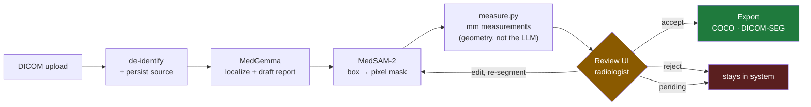
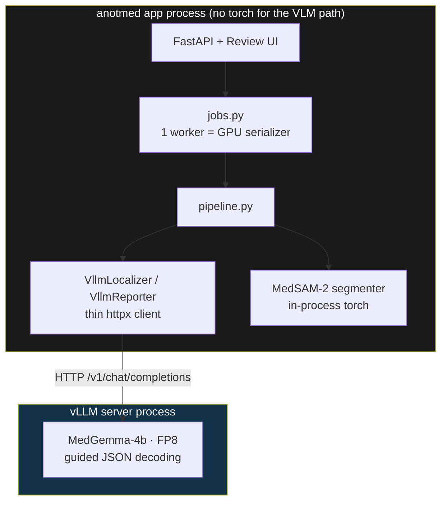
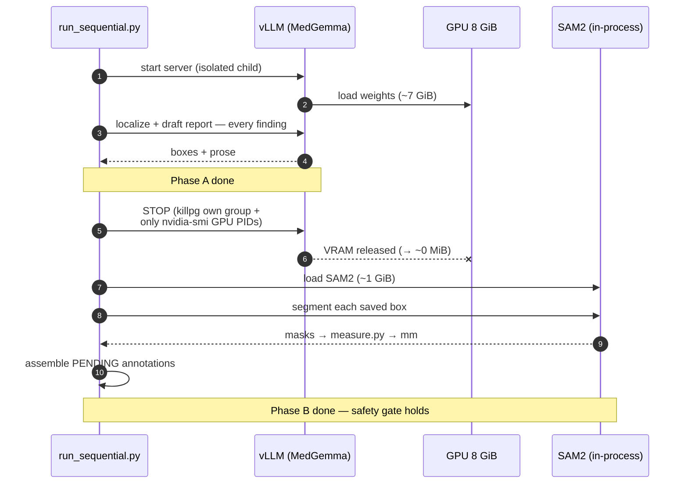
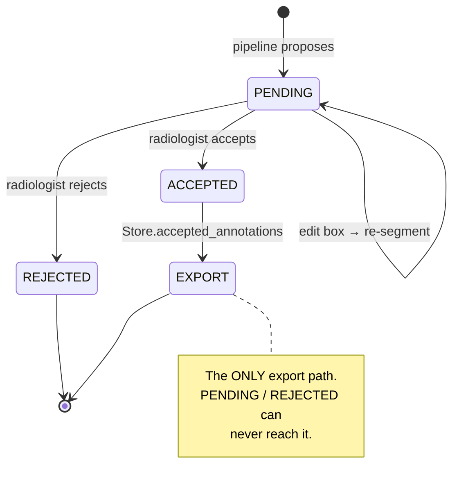
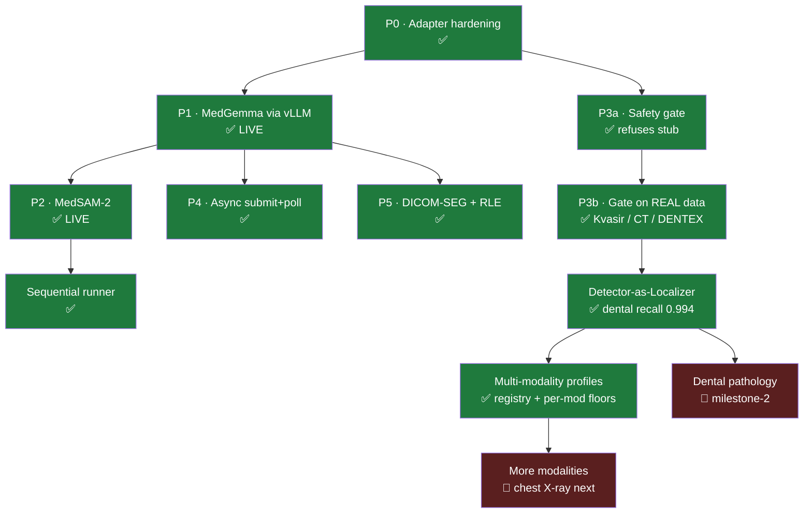
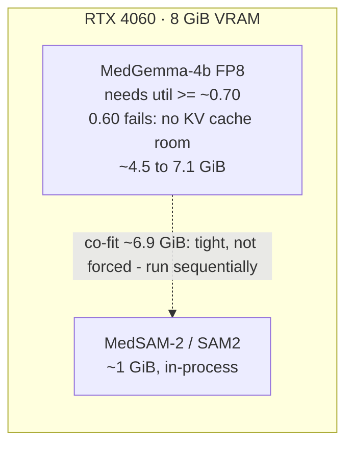

# anotmed — Architecture & Flow

Visual companion to [PLAN.md](PLAN.md) (detailed roadmap), [README.md](README.md)
(run steps), [SAFETY.md](SAFETY.md) (intended-use limits), and
[handover.md](handover.md) (session log). Diagrams are Mermaid — they render on
GitHub.

anotmed is a medical-image **annotation accelerator**, not a diagnostic device.
It proposes boxes, masks, and millimetre measurements; a radiologist accepts,
edits, or rejects every suggestion; **nothing leaves the system until a human
accepts it.**

---

## 1. The core flow

**Two rules encoded in code, not convention:**
- Measurements come from the **geometry engine** (`measure.py`) computed from the
  mask — never from the language model. The reporter writes prose; the numbers
  are reproducible and auditable.
- Only `ReviewStatus.ACCEPTED` annotations can be exported, exclusively via
  `Store.accepted_annotations`. See §4.

---

## 2. Deployment topology (why the app has no torch on the VLM path)

MedGemma runs in a **separate vLLM server process**; the anotmed app is a thin
HTTP client. MedSAM-2 can't be served by vLLM, so it runs **in-process** (torch).

Payoff: the entire backend is **unit-tested on CPU by mocking one HTTP call**
(88 tests, no GPU). GPU only enters at live-run time.

---

## 3. Two models, one 8 GiB GPU — sequential execution

On an RTX 4060 (8 GiB) MedGemma (FP8 ≈ 4.5–7 GiB) and MedSAM-2 (≈ 1 GiB) are a
tight fit together. `scripts/run_sequential.py` loads them **one at a time**: all
MedGemma work first (the reporter crops by box, so it never needs the mask), then
vLLM is fully stopped to free VRAM, then SAM2 runs.

**Teardown safety:** vLLM is a child launched with `start_new_session=True`; it is
killed by (a) its own process group and (b) *only* PIDs `nvidia-smi` reports as
holding the GPU. Those are model workers — never the shell or `/init`.

Alternative when you don't want to stop/start vLLM per study: keep vLLM at a
lower util and run the segmenter on CPU via `ANOTMED_SEG_DEVICE=cpu`.

---

## 4. The one invariant — human-in-the-loop, enforced in code

Guarded by `tests/test_safety_invariant.py` and `tests/test_api.py`, and re-proven
through the async path and the live server.

---

## 5. Phase roadmap — status

| Phase | State | Note |
|---|---|---|
| P0–P5, sequential runner | ✅ | hardening, vLLM MedGemma (live), MedSAM-2 (live), gate, async, DICOM-SEG/RLE |
| P3b Gate on **real data** | ✅ | ran on Kvasir (polyps), MSD Lung CT, DENTEX — honest measured misses drove the pivot |
| **Detector-as-Localizer** | ✅ | MedGemma localized poorly (0.0–0.37) → a YOLOv8n detector: **recall 0.994** on dental |
| **Multi-modality profiles** | ✅ | `modalities.py` registry; per-modality window/labels/`max_findings`/floors |
| Dental pathology (milestone-2) | 🔴 | 4-class caries/lesion detector — the clinical findings |
| More modalities | 🔴 | VinDr-CXR chest X-ray next (box-only path reused) |

**132 tests green.** Full detect→segment→measure→report→gate→export loop verified live on
real dental. The **finding of the whole exercise**: the localizer was the bottleneck, and a
dedicated detector — not a bigger VLM or a medical checkpoint — is what fixes it.

---

## 6. Memory budget (measured on RTX 4060, 8 GiB)

- **FP8, not bf16** — bf16 4B (~8.5 GiB) won't fit; FP8 (~4.5 GiB) does.
- MedGemma-only sweet spot: `--gpu-memory-utilization 0.85` (~7.1 GiB).
- Weights are cached + **gated**: run vLLM with `HF_HUB_OFFLINE=1` and pass the
  local `chat_template.jinja` (the repo ships `.jinja`, not the `chat_template.json`
  vLLM looks for). `scripts/serve_vllm.sh` handles all of this automatically.
